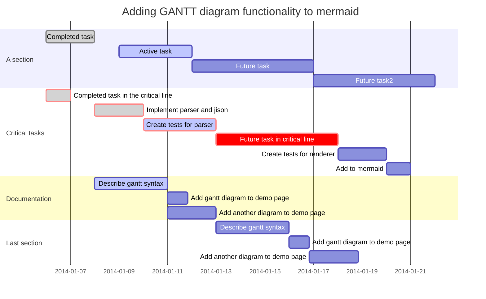

#We Practice

$$\left( \frac{kJ}{} \right) \left( \frac{kW}{kJ/s} \right) \left( \frac{h}{3600  s} \right)\left( \frac{kJ}{} \right)$$

We test everything a find profound

 An example of math within a paragraph — $$\frac{e}{\pi}+1=0$$
--- easy enough.

> Started with a 0730 bike ride. Isle of Mull, Scotland. 10 miles. It was a good ride to get things started. Not too strenuous. Needed that. *It starts with **me**.*

Must do

- [x] Email James Moore. Thanks for the show. Great contacts. Better advice. I had an epiphany.
- [ ] Brenna's letter
- [x] Email Long Island
- [x] Get Lisa, Holly opinions of epiphany
- [x] Contact PLC people individually.
- [ ] Work for Nolan. (Access, vpn)
- [ ] Work for the ECE dudes

For tomorrow

- [x] Get Dudley working on invention disclosure
- [ ] Plus everything above you didn't do today.

- [ ] [x]

An example of math within a paragraph — $ \frac{e}{\pi}+1=0 ​$--- easy enough.

$$
\begin{equation}
   \pi \alpha =  x_{1,2} = \frac{\sqrt{\frac{b}{2}-4ac }}{2a}
\end{equation}
$$

And one with exponents

$$\pi \alpha =  x_{1,2} = \frac{\sqrt{b^2-4ac }}{2a}$$

 $$  \pi \alpha =  x_{1,2} = \frac{\sqrt{b^2-4ac }}{2a} $$

An example of math within a paragraph --- \(\frac{e}{\pi}+1=0\)
--- easy enough.

Example $$\sum_{i=0}n_i^2 = \frac{(n^2+n)(2n+1)}{6}$$
$$
\sum_{i=0}n_i^2 = \frac{(n^2+n)(2n+1)}{6}
$$

paragraph --- $${{e}-{i\pi}+1=0}$$
--- easy enough.

$$ \frac{3}{8} $$
$$ \nicefrac{3}{8} $$

##Section 2
And an equation on its own: $${ x_{1,2}=\frac{b}{2}-4ac }​$$

Now a little MathPad $$x_5-\frac{\sqrt{\pi e}}{34}​$$

That's it.I l 1

%

Now a little MathPad $$ 1-{\left(\frac{\sqrt{\pi e}}{34}\right)}^{f} $$ Now a little MathPad is no dollars  \\(1 -{\left(\frac{\sqrt{\pi e}}{34}\right)}\^{f} \\) dollars It is not known exactly when the text obtained its current standard form; it may have been as late as the 1960s. Dr. Richard McClintock, a Latin scholar who was the publications director at Hampden–Sydney College in Virginia, discovered the source of the passage sometime before 1982 while searching for instances of the Latin word "consectetur", rarely used in classical literature.[1][a] The physical source of the Lorem Ipsum text may be the 1914 Loeb Classical Library Edition of the De Finibus, where the Latin text finishes page 34 with "Neque porro quisquam est qui do-" and begins page 36 with "lorem ipsum (et seq.)…", suggesting that the galley type of that page 36 was mixed up to make th

$$
\begin{tabular}
  1 & 2 & 3 \\
  4 & 5 & 6 \\
  7 & 8 & 9 \\
\end{tabular}
$$

Mmmmmmmmmm

That's it.

|                      |   Grouping    |              |
| -------------------- | :-----------: | :----------: |
| really?              | Second Header | Third Header |
| 1                    |      two      |      3       |
| Content    short man |               |              |
| Content              |   **Cell**    |     Cell     |

New section | More     | Data |
And more    | And more |      |

Now a little Morr MathPad \\[1-{\left(\frac{\sqrt{\pi e}}{34}\right)}^{f}\\]

That's it. Tables anyone?

| present  |         |         | Apologies |
| -------- | :-----: | ------: | --------- |
|          | Kristin |         | last      |
| Marcus   |         |    Lisa | last      |
| Meredith |         | Latrice | last      |
| Alvin    |         |   Karen | last      |

Now a little Morr MathPad \\[1-{\left(\frac{\sqrt{\pi e}}{34}\right)}^{f}\\]

That's it. Tables anyone? Latex style

Now  \\(
\begin{array}{ l | c | c | r }
		1 & 2 & 3 & \Sigma \\
		  \hline
		4 & 5 & 6 & \text{r} \\
		  \hline
		7 & 8 & \begin{array}{c | c | c} a & b & c \end{array} & 7 \\
		  \hline
		r & t & 1-{\left(\frac{\sqrt{\pi e}}{34}\right)}^{f} & 8 \\
\end{array}
\\) = \\(\begin{array}{c | c | c} a & b & c \end{array}\\)

\\(
\begin{array}{ l | c | c | r }
    	1 & 2 & 3 & \Sigma \\
    	  \hline
    	4 & 5 & 6 & \text{r} \\
    	  \hline
    	7 & 8 & \begin{array}{c | c | c} a & b & c \end{array} & 7 \\
    	  \hline
    	r & t & 1-{\left(\frac{\sqrt{\pi e}}{34}\right)}^{f} & 8 \\
\end{array}
 = \begin{array}{c | c | c} a & b & c \end{array}
\\)

Now with dollars.
$$
\begin{array}{ l | c | c | r }
    	1 & 2 & 3 & \Sigma \\
    	  \hline
    	4 & 5 & 6 & \text{r} \\
    	  \hline
    	7 & 8 & \begin{array}{c | c | c} a & b & c \end{array} & 7 \\
    	  \hline
    	r & t & 1-{\left(\frac{\sqrt{\pi e}}{34}\right)}^{f} & 8 \\
\end{array}
 = \begin{array}{c | c | c} a & b & c \end{array}
$$

Basically, it allows you to turn:

|                                 |   Grouping    |              |
| ------------------------------- | :-----------: | -----------: |
| First Header                    | Second Header | Third Header |
| Content             *Long Cell* |               |              |
| Content                         |   **Cell**    |         Cell |
| New section                     |     More      |         Data |
| And more                        |   And more    |              |
| [Prototype table]               |               |              |

into a table.

Editorial is a plain text editor for iOS with great Markdown support and powerful automation tools.

\\[W=
\begin{bmatrix}
e & g & h \\\
t & u & i  \\\
r & t & u \\\
\end{bmatrix}
\begin{bmatrix}a \\ b \\ c \end{bmatrix}
\\]

\begin{equation}
	W=
	\begin{bmatrix}
		e & g & h \\\
		t & u & i \\\
		r & t & u \\\
	\end{bmatrix}
	\begin{bmatrix}
		a\\\
	          b\\\
	          c
	\end{bmatrix}
\end{equation}

 works

 \\[\begin{matrix} a & b \\ c & d \end{matrix}\\]

 \\(\begin{bmatrix}a\\b\end{bmatrix}\\) works

Aut consectetur temporibus voluptatibus qui eligendi molestias eum. Dolor qui quaerat sit rerum sapiente. Molestias et accusantium eaque eos vel ad ea. Quia et temporibus et possimus recusandae id et quia. Hic dolorem omnis rem culpa dolor. Possimus labore eius suscipit perspiciatis magnam sed.

\\[W=
\begin{matrix}
e & g & h \\
t & u & i  \\
r & t & u \\
\end{matrix}
\begin{bmatrix}a\\b\\c\end{bmatrix}
\\]

Iusto corporis atque voluptas natus blanditiis odio. Sed aspernatur et illo ut repudiandae. Quia dolores pariatur aliquam qui quia in. Occaecati qui iste voluptas maiores corrupti rerum quo.

Est qui ut nulla sunt delectus ullam quos. Incidunt reprehenderit id corporis dolorem ab. Asperiores minus ad rem placeat quibusdam voluptatem voluptatem est. Voluptatum quae tempora ad beatae et repellendus qui. Consectetur distinctio a perspiciatis ea sit quae est.

Sit laudantium consequuntur in est quas repellat corrupti. Dolore magnam totam autem animi provident. Saepe voluptatem voluptatem nobis nulla assumenda. Nesciunt est aut aliquid mollitia sunt velit. Et ut minima aut commodi necessitatibus. Esse sunt debitis accusantium quo. Ipsam architecto unde laborum eos et.Make yourself at home with custom workflows, snippets, templates, and themes.

| 0                | 10   | 20   | 30   | 40   | 50                        | 60   | 70   | 80   | 90   |                   100 |
| ---------------- | ---- | ---- | ---- | ---- | ------------------------- | ---- | ---- | ---- | ---- | --------------------: |
| Cannot Do at All |      |      |      |      | Moderately Certain Can Do |      |      |      |      | Highly Certain Can Do |

<table>
  <tr>
    <td>0</td> <td>10</td> <td>20</td> <td>30</td> <td>40</td>
    <td>50</td> <td>60</td> <td>70</td> <td>80</td> <td>90</td>
    <td>100</td>
  </tr>
  <tr>
    <td colspan="4">Cannot Do at All</td>
    <td colspan="3">Cannot Do at All</td>
    <td colspan="4">Cannot Do at All</td>
  </tr>
</table>

<table>
  <thead>
   <tr>
    <th style='text-align:center;' colspan="3">0</th>
    <th style='text-align:center;' colspan="3">10</th>
    <th style='text-align:center;' colspan="3">20</th>
    <th style='text-align:center;' colspan="3">30</th>
    <th style='text-align:center;' colspan="3">40</th>
    <th style='text-align:center;' colspan="3">50</th>
    <th style='text-align:center;' colspan="3">60</th>
    <th style='text-align:center;' colspan="3">70</th>
    <th style='text-align:center;' colspan="3">80</th>
    <th style='text-align:center;' colspan="3">90</th>
    <th style='text-align:center;' colspan="3">100</th>
   </tr>
  </thead>

  <tbody>
   <tr>
    <td style='text-align:left;' colspan="9">Cannot Do at All</td>
    <td style='text-align:center;' colspan="15">Moderately Certain Can Do</td>
    <td style='text-align:right;' colspan="9">Highly Certain Can Do</td>
   </tr>
  </tbody>
</table>/
